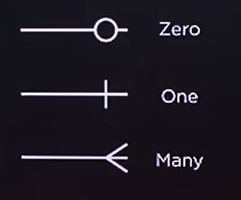

# SQLite Week 1 Lec 2 Relating

- [SQLite Week 1 Lec 2 Relating](#sqlite-week-1-lec-2-relating)
  - [Relational Databases](#relational-databases)
  - [Entity Relationship Diagrams | ERD| ER Diagrams](#entity-relationship-diagrams--erd-er-diagrams)
  
|command|description|
|-|-|
|`.tables`| to show tables in data base|
|||

## Relational Databases

**_kind of Relations_**

- one to one
- one to many
- many to many

## Entity Relationship Diagrams | ERD| ER Diagrams

